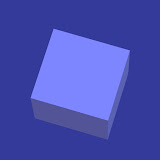

<!-- Imagem de Perfil -->

  

# Bernardo Sandrini

Olá! Me chamo **Bernardo Sandrini**, tenho **11 anos** e sou um desenvolvedor solo de jogos e aplicativos desde 2022. Atualmente, trabalho em alguns projetos interessantes como o **QuiosqueOS**, os **Servidores da Água Jump Studios** (minha própria empresa), e também um aplicativo de **quiz de amizade**, tudo com foco em criatividade e aprendizado constante.

## QuiosqueOS

O **QuiosqueOS** é o meu projeto mais evoluído e ambicioso até agora. Ele é um sistema operacional alternativo e interativo, projetado para simular um ambiente leve, funcional e customizável para uso educacional, criativo ou simplesmente por diversão. É uma vitrine de tudo que aprendi sobre desenvolvimento até agora, com foco em design limpo, responsividade e integração entre apps.

---

## 🌐 Meus Links

* 🎮 Estúdio: [Água JUMP Studio](https://linktr.ee/BernardoPlays)
* 📺 YouTube: [@BernardoPlays2025](https://www.youtube.com/@BernardoPlays2025)
* 🌐 Linktree: [linktr.ee/BernardoPlays](https://linktr.ee/BernardoPlays)

---

Sinta-se à vontade para explorar meus projetos ou entrar em contato!
